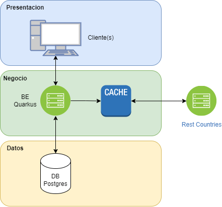

# **Client Manager API**  

## **Descripción**  
Este proyecto es un sistema de gestión de clientes desarrollado con **Quarkus**, **Hibernate ORM**, **PostgreSQL** y **Docker**. Proporciona una API REST para administrar clientes, con soporte para paginación, validaciones y cacheo de datos.

---

## **Características**  
✔️ CRUD de clientes  
✔️ Paginación y filtrado por país  
✔️ Validaciones con Hibernate Validator  
✔️ Integración con RestCountries API para obtener el gentilicio  
✔️ Documentación con Swagger  
✔️ Configuración para ejecutar en Docker  

---

## **Requerimientos**  

### **Para correr localmente**  
🔹 **JDK 17** o superior  
🔹 **Maven**  
🔹 **PostgreSQL** (versión 12 o superior)  
🔹 **Docker** (Opcional, si deseas ejecutar la base de datos en contenedor)

---

## Diagrama de arquitectura


🔗 [Más detalles](docs/architecture.md)

---

## **Instalación y Ejecución Local**  

1️⃣ **Clonar el repositorio**  
```bash
git clone https://github.com/MarcosPD3008/client-manager
cd client-manager
```

2️⃣ **Configurar la base de datos**  
Si usas PostgreSQL localmente, crea una base de datos llamada `client_manager` y configura el `application.properties`:  

```properties
# Configuración de la base de datos
quarkus.datasource.db-kind=postgresql
quarkus.datasource.username=admin
quarkus.datasource.password=admin
quarkus.datasource.jdbc.url=jdbc:postgresql://localhost:5432/client_manager

# Configuración de Hibernate
quarkus.hibernate-orm.database.generation=update
quarkus.hibernate-orm.log.sql=true
quarkus.datasource.jdbc.driver=org.postgresql.Driver

# Configuración de Swagger
quarkus.swagger-ui.always-include=true
quarkus.smallrye-openapi.path=/q/openapi
quarkus.swagger-ui.path=/swagger-ui

# API Externa
restcountries.api.url=https://restcountries.com/v3.1/alpha/
```

3️⃣ **Compilar y ejecutar la aplicación**  
```bash
mvn clean package
mvn quarkus:dev
```

4️⃣ **Acceder a la API**  
- API Base: `http://localhost:8080`  
- Swagger UI: `http://localhost:8080/swagger-ui`

---

---

## **Ejecución con Docker Compose**  

#### **1️⃣ Levantar la aplicación**
Ejecuta el siguiente comando para iniciar los contenedores:

```bash
docker-compose up -d
```

#### **2️⃣ Verificar que los contenedores están corriendo**
```bash
docker ps
```

#### **3️⃣ Detener los contenedores**
Para detener y eliminar los contenedores, usa:

```bash
docker-compose down
```

🔹 Ahora puedes acceder a la API en `http://localhost:8080` 🚀

---

## **Estructura del Proyecto**  

```
src/
├── main/
│   ├── java/org/acme/
│   │   ├── entity/        # Entidades JPA
│   │   ├── repository/    # Repositorios con Hibernate ORM
│   │   ├── service/       # Lógica de negocio
│   │   ├── resource/      # Controladores REST
│   │   ├── dto/           # Clases de transferencia de datos
│   │   ├── validation/    # Validaciones personalizadas
│   │   └── ClientManagerApplication.java  # Punto de entrada
│   ├── resources/
│   │   ├── application.properties  # Configuración de Quarkus
│   │   ├── import.sql   # Datos iniciales opcionales
│   │   └── META-INF/
└── test/               # Pruebas unitarias y de integración
```

---

## **Endpoints Principales**  

### **Clientes**

| Método  | Endpoint                                  | Descripción                          |
|---------|------------------------------------------|--------------------------------------|
| `GET`   | `/clients?page=1&size=10`               | Obtener clientes paginados          |
| `GET`   | `/clients/by-country/{country}?page=1&size=10` | Obtener clientes por país    |
| `POST`  | `/clients`                              | Crear un cliente                    |
| `PUT`   | `/clients/{id}`                         | Actualizar cliente                   |
| `DELETE`| `/clients/{id}`                         | Eliminar cliente                     |

---

## **Pruebas**  
Para ejecutar los tests unitarios y de integración:  
```bash
mvn test
```

## 📝 Decisiones de arquitectura (ADR)

### 📌 ADR-001: Selección de Base de Datos
Se decidió utilizar **PostgreSQL** como base de datos principal debido a su cumplimiento con ACID, su integración con Quarkus y Hibernate ORM, y su capacidad de escalabilidad. Otras opciones consideradas fueron MySQL y MongoDB, pero fueron descartadas por sus limitaciones en transacciones y manejo de datos relacionales.

🔗 [Más detalles](docs/adr/db.md)

### 📌 ADR-002: Mecanismo de Paginación
Se implementó un mecanismo de paginación para evitar enviar grandes volúmenes de datos al frontend, lo que mejoró el rendimiento y la eficiencia de la API. Se optó por el soporte de paginación de **Hibernate ORM con Panache** debido a su simplicidad y facilidad de integración con el repositorio genérico.

🔗 [Más detalles](docs/adr/pagination.md)

### 📌 ADR-003: Cacheo en Servicio de Países
Se implementó un mecanismo de cacheo en el servicio de países, ya que la información sobre gentilicios no cambia con frecuencia y así se evita depender del servicio externo en caso de caída.

🔗 [Más detalles](docs/adr/cache-country.md)